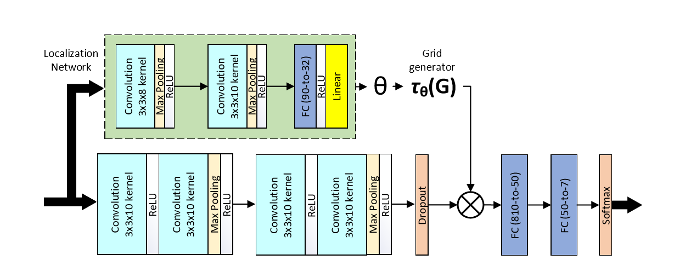
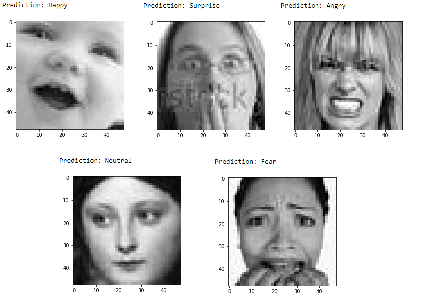

# Deep-Emotion: Facial Expression Recognition Using Attentional Convolutional Network

This is a PyTorch implementation of research paper, [Deep-Emotion](https://arxiv.org/abs/1902.01019)

[Note] This is not the official implementation of the paper

## Architecture
* An end-to-end deep learning framework, based on attentional convolutional network
* Attention mechanism is added through spatial transformer network


<p align="center">
  
</p>


## Datasets
* [FER2013](https://www.kaggle.com/c/challenges-in-representation-learning-facial-expression-recognition-challenge/data)
* [CK+](https://ieeexplore.ieee.org/document/5543262)
* [JAFFE](https://www.researchgate.net/publication/220013358_The_japanese_female_facial_expression_jaffe_database)
* [FERG](https://homes.cs.washington.edu/~deepalia/papers/deepExpr_accv2016.pdf)

## Prerequisites
To run this code, you need to have the following libraries:
* pytorch >= 1.1.0
* torchvision ==0.5.0
* opencv
* tqdm
* PIL

## Structure of this repository
This repository is organized as :
* [main](/main.py) This file contains setup of the dataset and training loop.
* [visualize](/visualize.py) This file contains the source code for evaluating the model on test data and real-time testing on webcam.
* [deep_emotion](/deep_emotion.py) This file contains the model class
* [data_loaders](/data_loaders.py) This file contains the dataset class
* [generate_data](/generate_data.py) This file contains the setup of the [dataset](https://www.kaggle.com/c/challenges-in-representation-learning-facial-expression-recognition-challenge/data)

## Usage
Cool [video](https://www.youtube.com/watch?v=yN7qfBhfGqs) created by [DeepLearning_by_PhDScholar](https://www.youtube.com/channel/UCUv49cJ3xwr1NXxl9qIJ7kA/about) for how to use this implementation.
### Data preparation
Download the dataset from [Kaggle](https://www.kaggle.com/c/challenges-in-representation-learning-facial-expression-recognition-challenge/data), and decompress ```train.csv``` and ```test.csv``` into ```./data``` folder.

### How to run
**Setup the dataset**
```
python main.py [-s [True]] [-d [data_path]]

--setup                 Setup the dataset for the first time
--data                  Data folder that contains data files
```

**To train the model**
```
python main.py  [-t] [--data [data_path]] [--hparams [hyperparams]]
                                [--epochs] [--learning_rate] [--batch_size]

--data                  Data folder that contains training and validation files
--train                 True when training
--hparams               True when changing the hyperparameters
--epochs                Number of epochs
--learning_rate         Learning rate value
--batch_size            Training/validation batch size
```

**To validate the model**
```
python visualize.py [-t] [-c] [--data [data_path]] [--model [model_path]]

--data                  Data folder that contains test images and test CSV file
--model                 Path to pretrained model
--test_cc               Calculate the test accuracy
--cam                   Test the model in real-time with webcam connect via USB
```
## Prediction Samples
<p align="center">
  
</p>
